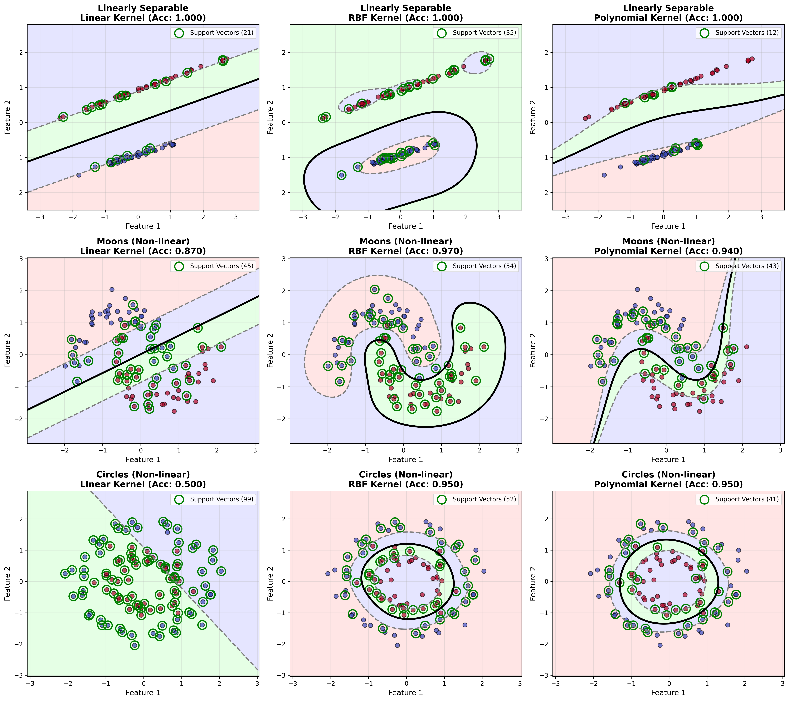
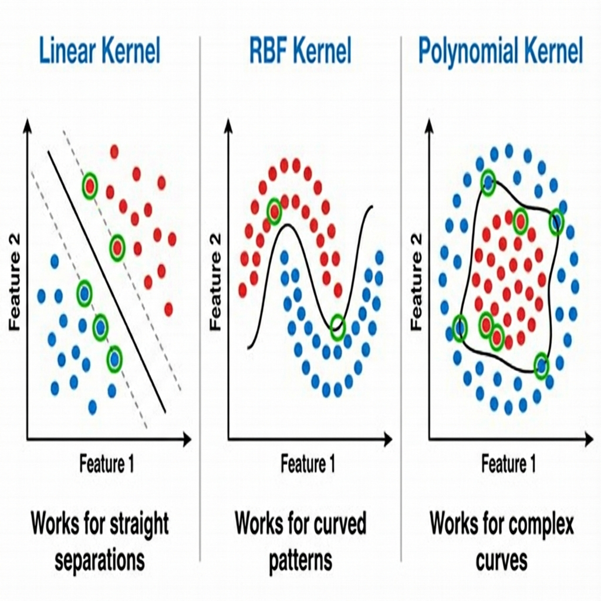
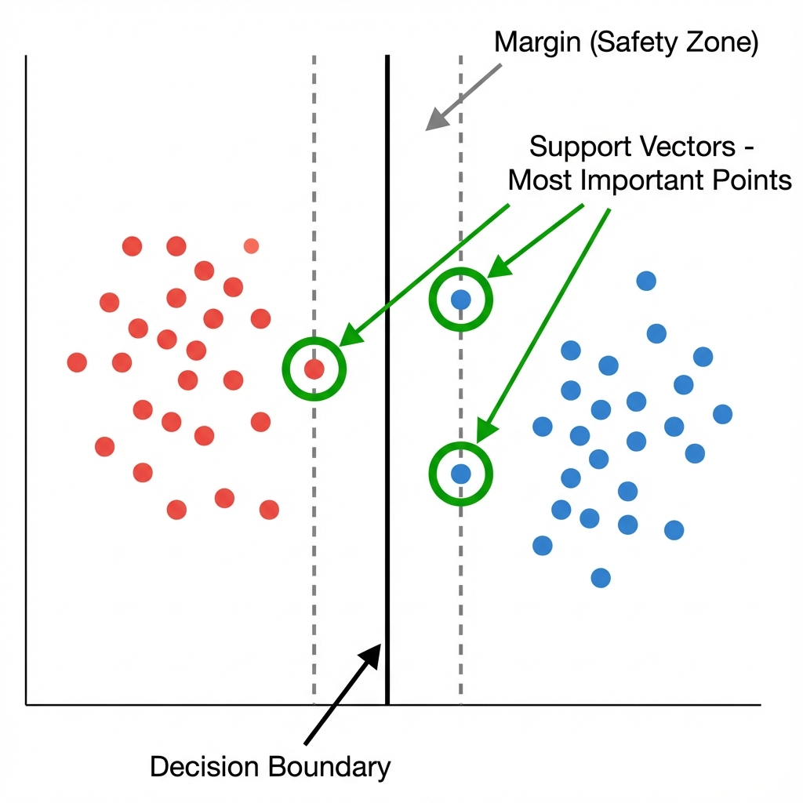

# Complete Beginner's Guide to SVM Kernels

## What is This Image Showing?



This image shows **9 different scenarios** arranged in a 3×3 grid. Let me explain what you're looking at:

### Quick Visual Summary



### Understanding Support Vectors



---

## Understanding the Basics First

### What is Machine Learning Classification?

Imagine you have a bunch of colored dots on a piece of paper:

- 🔴 Red dots represent one category (like "spam emails")
- 🔵 Blue dots represent another category (like "normal emails")

**The goal**: Draw a line (or curve) that separates red dots from blue dots, so when a new dot appears, you can tell which side it belongs to.

### What is SVM (Support Vector Machine)?

SVM is like a smart ruler that finds the **best possible line** to separate your dots. "Best" means:

- The line should separate the colors correctly
- The line should be as far as possible from the nearest dots on both sides

---

## Breaking Down the Image

### The 3 Rows (Different Data Patterns)

#### Row 1: "Linearly Separable"

**What it is**: Dots that can be separated by a straight line  
**Real-world example**: Separating tall people from short people based on height

#### Row 2: "Moons (Non-linear)"

**What it is**: Dots arranged in two crescent moon shapes  
**Real-world example**: Like separating two interlocking puzzle pieces - you need a curved line

#### Row 3: "Circles (Non-linear)"

**What it is**: Dots arranged in two circles, one inside the other  
**Real-world example**: Like separating an inner circle from an outer ring - impossible with a straight line!

### The 3 Columns (Different Kernels)

A **kernel** is like choosing different types of rulers:

#### Column 1: Linear Kernel

- **What it does**: Draws straight lines only
- **When it works**: Only for data that can be separated by straight lines
- **Analogy**: Using a regular ruler

#### Column 2: RBF Kernel (Radial Basis Function)

- **What it does**: Draws smooth, curved boundaries
- **When it works**: Almost any pattern, very flexible
- **Analogy**: Using a flexible rubber ruler that can bend

#### Column 3: Polynomial Kernel

- **What it does**: Draws polynomial curves (like parabolas)
- **When it works**: Data with curved relationships
- **Analogy**: Using a French curve drawing tool

---

## Reading Each Plot

Let me explain what you see in each small plot:

### The Colors

- **Red/Pink areas**: "This region is classified as Class 1"
- **Blue areas**: "This region is classified as Class 2"
- **Light colors**: Areas far from the boundary (very confident)
- **Darker colors**: Areas near the boundary (less confident)

### The Lines

- **Black solid line**: The decision boundary (the main separator)
- **Gray dashed lines**: The margins (safety zones on each side)

### The Dots

- **Red dots**: Actual data points from Class 1
- **Blue dots**: Actual data points from Class 2
- **Green circles**: Support vectors (the most important dots that define the boundary)

### The Accuracy Number

- **Example: "Acc: 1.000"** means 100% correct (perfect!)
- **Example: "Acc: 0.500"** means 50% correct (terrible, like flipping a coin)

---

## Analyzing Each Row

### Row 1: Linearly Separable Data

```
Linear Kernel (Acc: 1.000)     RBF Kernel (Acc: 1.000)     Polynomial Kernel (Acc: 1.000)
```

**What's happening**: All three kernels achieve perfect accuracy!  
**Why**: The data is simple - it can be separated by a straight line  
**Lesson**: For simple data, even a simple method works perfectly

### Row 2: Moons Data (Crescent Shapes)

```
Linear Kernel (Acc: 0.860)     RBF Kernel (Acc: 0.950)     Polynomial Kernel (Acc: 0.900)
```

**What's happening**:

- Linear kernel struggles (86% accuracy) - it's trying to use a straight line on curved data!
- RBF kernel does best (95%) - it can create smooth curves
- Polynomial kernel is okay (90%) - it can curve, but not as smoothly

**Lesson**: For curved patterns, you need curved boundaries

### Row 3: Circles Data (Ring Pattern)

```
Linear Kernel (Acc: 0.500)     RBF Kernel (Acc: 1.000)     Polynomial Kernel (Acc: 1.000)
```

**What's happening**:

- Linear kernel completely fails (50% = random guessing!) - you can't separate circles with a straight line
- RBF kernel perfect (100%) - creates a circular boundary
- Polynomial kernel perfect (100%) - creates a curved boundary

**Lesson**: For complex patterns, you MUST use non-linear kernels

---

## Understanding the Code

Let me break down the code step by step:

### Part 1: The SVM Class (The Brain)

```python
class SVM:
    def __init__(self, C=1.0, kernel='linear', gamma=0.1):
```

**What this does**: Creates an SVM object with settings:

- `C`: How much to punish mistakes (higher = stricter)
- `kernel`: Which type of line to draw ('linear', 'rbf', or 'polynomial')
- `gamma`: How curvy the line can be (for RBF/polynomial)

### Part 2: The Kernel Function (The Magic)

```python
def kernel(self, x1, x2):
    if self.kernel_type == 'linear':
        return np.dot(x1, x2)  # Straight line math
    elif self.kernel_type == 'rbf':
        return np.exp(-self.gamma * np.linalg.norm(x1 - x2) ** 2)  # Curved math
```

**What this does**:

- Takes two points and calculates their "similarity"
- Different kernels use different math formulas
- This is what allows curved boundaries!

**The Math (Simplified)**:

- **Linear**: Just multiply the coordinates (simple)
- **RBF**: Use exponential function (creates smooth curves)
- **Polynomial**: Raise to a power (creates polynomial curves)

### Part 3: Training (Learning)

```python
def fit(self, X, y):
    # SMO algorithm - finds the best boundary
```

**What this does**:

1. Looks at all your data points
2. Tries different boundaries
3. Finds the one that:
   - Separates the classes best
   - Has the widest margin (safety zone)
4. Remembers the "support vectors" (most important points)

**Analogy**: Like trying different ways to draw a line until you find the best one

### Part 4: Prediction (Using What We Learned)

```python
def predict(self, X):
    # For each new point, decide which side of the boundary it's on
```

**What this does**:

- Takes a new point
- Checks which side of the boundary it's on
- Returns the predicted class (red or blue)

---

## The Datasets Explained

### 1. Linearly Separable Dataset

```python
make_classification(n_samples=100, n_features=2, class_sep=2.0)
```

**What it creates**: 100 points in 2D space, clearly separated  
**Looks like**: Two clouds of dots with space between them  
**Real-world example**: Separating apples from oranges based on size and color

### 2. Moons Dataset

```python
make_moons(n_samples=100, noise=0.15)
```

**What it creates**: Two interleaving crescent moon shapes  
**Looks like**: ( ) and ) ( facing each other  
**Real-world example**: Separating two curved patterns, like classifying handwritten "C" vs "D"

### 3. Circles Dataset

```python
make_circles(n_samples=100, noise=0.1, factor=0.5)
```

**What it creates**: One circle inside another circle  
**Looks like**: ⊙ (a target/bullseye)  
**Real-world example**: Separating inner city residents from suburban residents based on distance from center

---

## Key Concepts Visualized

### Support Vectors (Green Circles)

**What they are**: The dots closest to the decision boundary  
**Why they matter**: These are the ONLY dots that matter for drawing the boundary!  
**Analogy**: Like the corner posts of a fence - remove other posts and the fence stays the same

In the image, you can see green circles around certain dots - these are the support vectors.

### Decision Boundary (Black Line)

**What it is**: The line/curve that separates the two classes  
**How it's chosen**: To be as far as possible from the nearest dots on both sides  
**Analogy**: Like drawing a road exactly in the middle between two neighborhoods

### Margins (Gray Dashed Lines)

**What they are**: The "safety zones" on each side of the decision boundary  
**Why they matter**: Wider margins = more confident predictions  
**Analogy**: Like guardrails on a highway - the wider apart, the safer

---

## The Big Picture: When to Use Each Kernel

### Use Linear Kernel When

✅ Your data is roughly separable by a straight line  
✅ You have many features (high dimensions)  
✅ You want fast training  
✅ You want to understand which features matter  

**Examples**: Text classification, spam detection

### Use RBF Kernel When

✅ You don't know the pattern in advance  
✅ Your data has curved patterns  
✅ You have enough data and computing power  

**Examples**: Image recognition, general classification

### Use Polynomial Kernel When

✅ You know the relationship is polynomial  
✅ You want something between linear and RBF  

**Examples**: Specific scientific applications

---

## How the Code Creates This Image

```python
def visualize_kernel_effects():
    # Create 3 different datasets
    datasets = [
        ('Linearly Separable', ...),
        ('Moons', ...),
        ('Circles', ...)
    ]
    
    # Try 3 different kernels
    kernels = [
        ('Linear', ...),
        ('RBF', ...),
        ('Polynomial', ...)
    ]
    
    # For each combination (3×3 = 9 plots)
    for each dataset:
        for each kernel:
            1. Train the SVM
            2. Calculate accuracy
            3. Draw the decision boundary
            4. Plot the results
```

**Result**: A 3×3 grid showing all combinations!

---

## Understanding the Performance

### Why Linear Fails on Circles (50% accuracy)

Imagine trying to separate a bullseye target with a straight line:

- No matter where you draw the line, you'll cut through both colors
- You'll always be wrong about half the points
- 50% = random guessing!

### Why RBF Succeeds on Circles (100% accuracy)

RBF can create a circular boundary:

- It draws a circle around the inner dots
- Perfectly separates inner from outer
- 100% = perfect classification!

---

## Practical Takeaway

**The main lesson from this image**:

> Different problems need different tools. A straight ruler (linear kernel) works great for straight lines, but you need a flexible tool (RBF kernel) for curves!

**In machine learning terms**:

- Always try the simple method first (linear)
- If it doesn't work well, try more complex methods (RBF, polynomial)
- Look at your data pattern to choose the right kernel

---

## Summary

This image is a **visual proof** that:

1. **Linear kernels** work only for linearly separable data
2. **RBF kernels** are flexible and work for most patterns
3. **Polynomial kernels** are good for curved boundaries
4. **The right tool matters** - using the wrong kernel can give terrible results!

The code creates this comparison automatically, testing all combinations and showing you visually which kernel works best for which data pattern.
